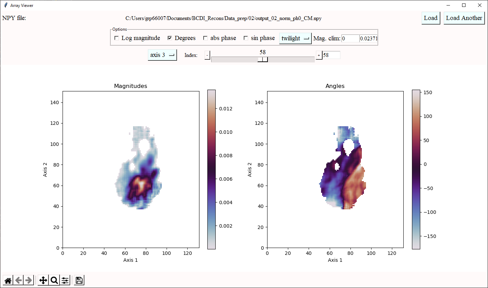

# complex_array_viewer
Simple tk interface for viewing 3D complex numpy arrays.



**Version 0.1**

| By Dan Porter | 
| --- |
| Diamond Light Source |
| 2023 |


#### To run viewer:
```commandline
$ python -m complex_array_viewer 'file.npy'
```

or in python:
```python
from complex_array_viewer import ComplexArrayViewer
ComplexArrayViewer('file.npy')
```

#### Requires:
*numpy, matplotlib, tkinter*


#### Usage:
Start by clicking "Load" to load a complex 3D .npy file.

The magnitudes and phases will be displayed with a slider to scroll through the slices.

The axis of slicing can be choosen, and various options can be altered, including:

- View the log of the amplitudes
- View the phases in Degrees (rather than phases)
- View the absolute phases (|phase < 0|)
- View the sin of the phases
- Colormap (cyclic colormaps are twilight and hsv)
- Colormap limits